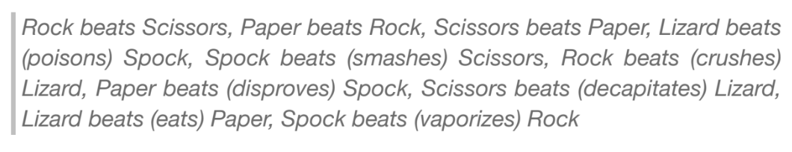

# Task 1 - Rock Paper Scissors  

Create a single function (the skeleton has been provided for you). The function must be capable of 'playing' a single round of the classic game 'Rock, Paper, Scissors':

**Rock beats Scissors, Scissors beats paper, Paper beats rock**

When called, the function should return the winning player reference (i.e., 'player1' or 'player2' or 'draw') as a single string.

Evidence of testing is expected. You should test your solution by making sufficient calls to your function so that you are positive that it works as expected. These should be left at the bottom of ```rps.py``` commented out.

Your final version should demonstrate evidence of being refactored; please note, refactoring is not bug-fixing - essentially it is reducing complexity and simplifying your codebase such that it is as efficient, readable, structured and as manageable as possible.

Some example calls to the function:

```python
rock_paper_scissors("paper", "paper")    # should return "draw"
rock_paper_scissors("scissors", "paper")  # should return "player1"
rock_paper_scissors("paper", "scissors")  # should return "player2"
```

## Additional criteria.

Once you have the basic version working, extend your function so that it supports Sheldon Cooper's 'Big Bang' version 'Rock, Paper, Scissors, Lizard, Spock'. Remember to write the tests!


  
  
## Submission Checklist

Prior to actually submitting your final attempt you should ensure you have reviewed and considered the following checklist.


1. Refactored ```rock_paper_scissors``` function.
2. Does your solution follow accepted coding conventions?
3. Your 'test' code, commented out at the bottom of ```rps.py```


## Tasks 1-4 Coding Standards rubric


| Marks | Programming Conventions                                                                                                                                                                                                                                                                                                                                                                            |
|-------|------------------------------------------------------------------------------------------------------------------------------------------------------------------------------------------------------------------------------------------------------------------------------------------------------------------------------------------------------------------------------------------------------------|
| 72-84-97%  (Exceeds expectations. Excellent to exceptional evidence.)   | Code is exemplary in its organisation, clarity, and maintainability, adhering to industry best practices and coding standards. It employs descriptive variable names, consistent indentation, and is self-documenting, requiring minimal comments. |
| 42-55-68% (Meets expectations. Satisfactory to Good Evidence.)     | Code is well-structured and readable, largely aligning with industry best practices and coding standards. It utilises clear variable names and consistent indentation, with comments used judiciously for clarity.                      |
| 30-34-38% (Below Expectation. Limited evidence. Marginal fail.)    | Code displays reasonable organisation and readability, with potential for refinement in variable naming, indentation and making the code more self-explanatory. This indicates a developing understanding of programming conventions.                                                                                                   |
| 15-20-25%  (Poor attempt. Minimal evidence. Clear fail.)   | Code demonstrates initial efforts towards organisation and readability but requires significant enhancements to improve clarity, maintainability and adherence to industry best practices. This suggests a need for further development in programming conventions and software design principles.                                                            |
| 0%     | No attempt                                                                                                                                                                                            |


